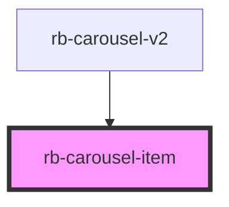

# rb-carousel-item

<!-- Auto Generated Below -->

## Properties

| Property   | Attribute   | Description             | Type     | Default     |
| ---------- | ----------- | ----------------------- | -------- | ----------- |
| `imageAlt` | `image-alt` | Image alt tag           | `string` | `undefined` |
| `imageUrl` | `image-url` | Direct URL to the image | `string` | `undefined` |

## Events

| Event                 | Description | Type                   |
| --------------------- | ----------- | ---------------------- |
| `carouselItemClicked` |             | `CustomEvent<boolean>` |

## Dependencies

### Used by

 - [rb-carousel-v2](../rb-carousel-v2)

### Graph

----------------------------------------------

*Built with [StencilJS](https://stenciljs.com/)*
