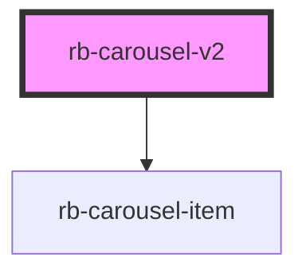

# rb-carousel-v2

<!-- Auto Generated Below -->

## Properties

| Property            | Attribute             | Description                                          | Type                                      | Default       |
| ------------------- | --------------------- | ---------------------------------------------------- | ----------------------------------------- | ------------- |
| `items`             | --                    | Items to display                                     | `CarouselItem[]`                          | `[]`          |
| `size`              | `size`                | Size of the carousel images                          | `Size.Large \| Size.Medium \| Size.Small` | `Size.Medium` |
| `slideIntervalTime` | `slide-interval-time` | Time interval for slides automatic switching (in ms) | `number`                                  | `undefined`   |

## Dependencies

### Depends on

- [rb-carousel-item](../rb-carousel-item)

### Graph

----------------------------------------------

*Built with [StencilJS](https://stenciljs.com/)*
